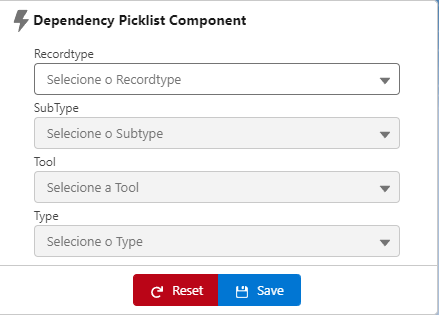

# Dependency Picklist 


This component can be used to do a Dependency Picklist from custom metadata.

## 💻 How I to use?

If you can you this component, clone this repository and push using SFDX to your org, follow instructions:

1. Clone this repository:

```
git clone https://github.com/jhownfs/DependencyPicklist.git
cd DependencyPicklist
```

2. Authorize with your org and provide it with an alias (OrgAlias):

```
sfdx force:auth:web:login -a "OrgAlias"
```

3. Push the app to your org:

```
sfdx force:source:deploy --sourcepath force-app/main/default --json --loglevel fatal --targetusername "OrgAlias"
```

4. Open the default org:

```
sfdx force:org:open --targetusername "OrgAlias"
```

## USE CASE

Sometimes we need to customize standard dependency picklist Salesforce to use custom logic for some reasons, standard picklist values limit, standard dependency limit, or more...So I created this component to solve this problem, using custom LWC and Custom metadata.

You can modify and adjust according to your needs.


## HOW THIS COMPONENT WORKS

You can use this component inside any object, but it's important this object has field that contain the same name, to insert values selected.


Component reads informations about dependency picklist from Custom metadata that has the same name.


Labels inside component come from Custom Labels Salesforce.


## Next Updates 🚀

[x] Add prints in readME to explain more about component works

[] Apply Some Design patterns to standardized to back and front (We have code smells here)

[] Dynamic picklist values and dependency (Consider another object structure)

## Find some bug or want to help, please open a PR 🚩

## Licença 📝

This project is under license. Se the file [License](LICENSE) for more details.

[⬆ Voltar ao topo](https://github.com/jhownfs/GlobalsearchLWC.git)<br>
